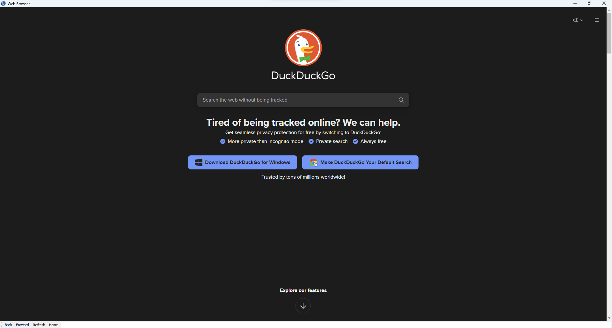

# Web Browser 🌍
The following app is a basic web browser made with python.

# How to use it ⌨️
1. Type your search in the search engine bar or type the url in the navigation bar
2. Use the navigation bar controls:
    * Back
    * Forward
    * Refresh
    * Home

    

# Convert the python file into an .exe 🐍
If you want to convert this file into a window's executable file just follow these steps:

1. Open your terminal
2. Install pyinstaller `pip install pyinstaller`
3. Select the python file named ***__main__.py*** and the ***icon.ico*** file
    ~~~
    pyinstaller.exe --onefile --icon=icon.ico __main__.py
    ~~~
4. Press ***Enter***
5. **Done!** 🥳